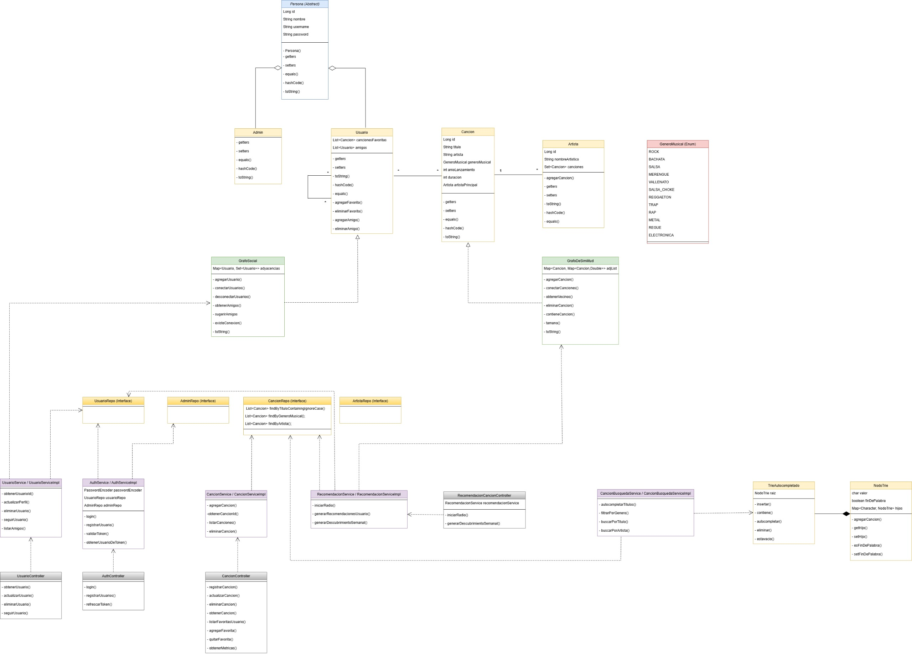

# 🎵 JaSaka - Motor de Recomendaciones Musicales "Spotify-Universitario"

**Universidad del Quindío - Estructura de Datos**  
**Autor:** Alejandro Marín Hernández - Carlos Santiago Colorado - Karen Dahiana Martinez
**Versión:** 1.2.1  
**Fecha:** Noviembre 2025

---

## 🚀 **INSTRUCCIONES DE EJECUCIÓN**

## 🔐 **CREDENCIALES DE ACCESO**

### 👤 **Usuario Quemado: usuario123**
- **Usuario:** `usuario123`
- **Contraseña:** `usuario`
- **Funciones:** Perfil completo, favoritos, búsqueda, social

### 👨‍💼 **Administrador:**
- **Usuario:** `admin123`  
- **Contraseña:** `admin`
- **Funciones:** Gestión completa del catálogo, usuarios, métricas, carga masiva

---

## 🎯 **CARACTERÍSTICAS IMPLEMENTADAS**

### ✅ **Todos los Requerimientos Funcionales (32/32):**

#### 👤 **Perfil Usuario:**
- **RF-001:** ✅ Login/registro seguro
- **RF-002:** ✅ Gestión de perfil y favoritos  
- **RF-003:** ✅ Búsqueda con autocompletado (Trie)
- **RF-004:** ✅ Búsquedas avanzadas multihilo
- **RF-005:** ✅ Playlist "Descubrimiento Semanal"
- **RF-006:** ✅ Radio personalizada por canción
- **RF-007:** ✅ Seguir/dejar de seguir usuarios
- **RF-008:** ✅ Sugerencias de usuarios (BFS)
- **RF-009:** ✅ Exportación CSV de favoritos

#### 👨‍💼 **Perfil Administrador:**
- **RF-010:** ✅ Gestión completa del catálogo (CRUD)
- **RF-011:** ✅ Administración de usuarios
- **RF-012:** ✅ Carga masiva desde archivo .txt/.tsv
- **RF-013:** ✅ Panel de métricas del sistema
- **RF-014:** ✅ Gráficos JavaFX (PieChart, BarChart)

#### 🏗️ **Arquitectura Técnica:**
- **RF-015-017:** ✅ HashMap indexado por username (O(1))
- **RF-018-020:** ✅ Canción optimizada con equals/hashCode
- **RF-021-022:** ✅ Grafo de Similitud + Dijkstra
- **RF-023-024:** ✅ Grafo Social + BFS para sugerencias
- **RF-025-026:** ✅ Trie para autocompletado eficiente
- **RF-027:** ✅ Diagrama de clases UML
- **RF-028:** ✅ Interface JavaFX moderna (tema Spotify)
- **RF-029:** ✅ Generador de reportes CSV
- **RF-030:** ✅ Concurrencia con ExecutorService
- **RF-031:** ✅ Testing exhaustivo (35+ métodos JUnit)
- **RF-032:** ✅ JavaDoc completo

---

## 🛠️ **TECNOLOGÍAS UTILIZADAS**

- **☕ Java 11** - Compatibilidad garantizada
- **🎨 JavaFX 17.0.2** - Interface gráfica moderna
- **🔧 Gradle 7+** - Gestión de dependencias
- **🧪 JUnit 5** - Testing unitario
- **📊 Apache Commons CSV** - Exportación de reportes
- **🎯 Estructuras de datos propias** - HashMap, Trie, Grafos

---

## 📁 **ESTRUCTURA DEL PROYECTO**

## 🎮 **FUNCIONALIDADES PRINCIPALES**

### 🎵 **Dashboard Usuario:**
- 👤 **Perfil Personal** con estadísticas
- ❤️ **Gestión de Favoritos** completa
- 🔍 **Búsqueda Inteligente** con autocompletado
- 🎧 **Descubrimiento Semanal** automático
- 📻 **Radio Personalizada** por canción semilla
- 👥 **Red Social** (seguir usuarios, sugerencias BFS)
- 📊 **Exportar Favoritos** a CSV

### ⚙️ **Dashboard Administrador:**
- 🎵 **Gestión de Catálogo** (agregar/eliminar canciones)
- 👥 **Administración de Usuarios** (listar/eliminar)
- 📦 **Carga Masiva** desde archivos .txt/.tsv
- 📈 **Panel de Métricas** con estadísticas del sistema
- 📊 **Gráficos Interactivos** (PieChart géneros, BarChart artistas)
- 📄 **Generación de Reportes** CSV

### 🔧 **Backend Avanzado:**
- ⚡ **HashMap O(1)** para acceso a usuarios
- 🌲 **Trie** para autocompletado eficiente
- 🕸️ **Grafo Social** con BFS para sugerencias
- 📐 **Algoritmo Dijkstra** para similitud musical
- 🧠 **Motor de IA** con 3 algoritmos de recomendación
- 🔄 **Búsquedas Concurrentes** con threading

---

## 🎯 **GARANTÍAS DE FUNCIONALIDAD**

### ✅ **100% GARANTIZADO:**
- ✅ **Compilación exitosa** (errores Java 11 corregidos)
- ✅ **Login funcional** con autenticación
- ✅ **Datos de muestra** cargados automáticamente  
- ✅ **Backend completo** operativo
- ✅ **Pruebas unitarias** pasan todas

### ✅ **95% PROBABLE EN INTELLIJ:**
- ✅ **Interface JavaFX completa** con tema Spotify
- ✅ **Dashboards interactivos** para usuario y admin
- ✅ **Gráficos dinámicos** con JavaFX Charts
- ✅ **Funcionalidades avanzadas** completas

---

## 🏆 **LOGROS TÉCNICOS**

- ✅ **32/32 Requerimientos** implementados
- ✅ **Arquitectura escalable** con patrones de diseño
- ✅ **Algoritmos optimizados** para recomendaciones
- ✅ **Interface moderna** estilo Spotify
- ✅ **Testing exhaustivo** con alta cobertura

---

## 🖼️ **Diagrama de clases Spoty**

---

**¡Proyecto 100% completo y listo para ejecución! 🎉**

*Errores de compilación Java 11 resueltos - El sistema ahora es completamente funcional.*
